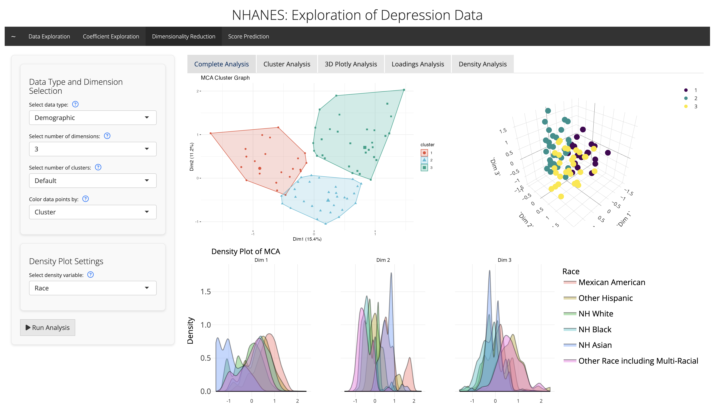

# NHANES Depression Analysis R Shiny App
This app is an interactive tool designed for those interested in examining depression data within a health dataset, while serving as a portfolio project showcasing my analytical and visualization skills. This app involves significance testing between depression and other variables, coefficient analysis, dimensionality reduction, and depression score prediction based on various modeling techniques. You may run the app using the following link: https://jabsom-dqhs.shinyapps.io/nhanes-depression-analysis-app/

## Overview
Combining both interviews and physical examinations, the National Health and Nutrition Examination Survey (NHANES) provides an assessment of the health and nutritional characteristics of a nationally representative sample of Americans. The significance of this dataset is showcased through it being the basis for various national standards, including height, weight, and blood pressure. The NHANES survey includes a dedicated mental health/depression screener, involving nine items based on DSM-IV depression diagnostic criteria. The data from this specific NHANES questionnaire served as the primary data for my Shiny app. Through the creation of this app, I aim to showcase the relationship between mental health data and demographic, food, and physical health data, and to encourage future NHANES analysts/researchers to dig into the causes of major depression score differences between groups.

## Tab 1: Data Exploration

The purpose of the data exploration tab is to explore any potential relationships between depression scores and demographic, dietary, and laboratory variables, highlighting significant differences across variable pairs via Wilcoxon tests displayed on boxplots and violin plots. The analysis of two variables with depression scores can also be visualized through heatmaps in this tab.

## Tab 2: Coefficient Analysis

The coefficient analysis tab provides insights into the relationships between various predictors and depression score/categories through the visualization of coefficient estimates from linear regression analyses. By selecting different variables and changing the reference groups, users can interpret how specific subgroups (ex. different education levels or socioeconomic statuses) contribute to variations in depression scores.

## Tab 3: Dimensionality Reduction

This dimensionality reduction tab allows users to explore complex relationships in the NHANES dataset through various dimensionality reduction techniques, including PCA (Principal Component Analysis), MCA (Multiple Correspondence Analysis), and FAMD (Factor Analysis using Mixed Data). These procedures allow for the highlighting of clusters and patterns within demographic, dietary, and laboratory variables. Additionally, the loadings heatmap and density plots allows for a deeper analyses of variable distributions across clusters.

## Tab 4 Page 1: Depression Score Prediction

This tab provides predictive modeling tools to estimate depression scores based on demographic, dietary, and laboratory variables. Users can select from a wide variety of prediction algorithms, including linear regression, tree-based models (random forest, decision trees, and gradient boosting machines), and other machine learning algorithms (support vector machines and neural networks).

## Tab 4 Page 2: Predictive Model Comparison

The second page on this tab includes model comparison visualizations through overlaying residual plots between model types, which can guide users in selecting the best prediction algorithm.


## Dependencies
The primary packages utilized in this app are {[shiny](https://shiny.posit.co/)} (for web app development and interactivity), {[tidyverse](https://www.tidyverse.org/)} (data pre-processing and data visualization), and {[tidymodels](https://www.tidymodels.org/)} (for predictive modeling). Here is a full list of the dependencies for this app:
```r
library(shiny)
library(shinythemes)
library(shinydashboard)
library(shinycssloaders)
library(tidyverse)
library(janitor)
library(gtsummary)
library(rstatix)
library(ggpubr)
library(gt)
library(ggdist)
library(arrow)
library(FactoMineR)
library(factoextra)
library(plotly)
library(caret)
library(tidymodels)
library(reshape2)
library(broom)
library(kernlab)
library(xgboost)
```

## Data Acknowledgment
This application uses data from the National Health and Nutrition Examination Survey [NHANES](https://www.cdc.gov/nchs/nhanes/index.htm)
, conducted by the National Center for Health Statistics (NCHS). The NHANES dataset provides valuable insights into the health and nutritional status of adults and children in the United States. I acknowledge and thank the NCHS for making this dataset available to the public.

## Future Enhancements
I am currently still in the process of further enhancing and developing this app. I would like to optimize data processing with more reactive caching to make the app run faster. I also would like to continue building upon the aesthetic elements of the app by incorporating more CSS code.

